- [Il perche' di questa guida](#il-perche-di-questa-guida)
- [Passaggi che verranno illustrati](#passaggi-che-verranno-illustrati)
- [Condizioni preliminari](#condizioni-preliminari)
  - [Connessione VLAN](#connessione-vlan)
  - [Modifica indirizzo di rete di default](#modifica-indirizzo-di-rete-di-default)
- [Configurazione delle VLAN per i dispositivi fisici](#configurazione-delle-vlan-per-i-dispositivi-fisici)
  - [Native VLAN](#native-vlan)
    - [Uso della native VLAN per la configurazione di eventuali server Proxmox](#uso-della-native-vlan-per-la-configurazione-di-eventuali-server-proxmox)
  - [Rimuovere la LAN principale da br-lan di default e associarla alla VLAN principale](#rimuovere-la-lan-principale-da-br-lan-di-default-e-associarla-alla-vlan-principale)
  - [Definire le interfacce per tutte le VLAN](#definire-le-interfacce-per-tutte-le-vlan)
    - [Definizione di tutte le interfacce](#definizione-di-tutte-le-interfacce)
      - [Versioni piu' vecchie](#versioni-piu-vecchie)
      - [Versioni nuove (es.21...)](#versioni-nuove-es21)
  - [Consentire la gestione del router dall'interfaccia home (via firewall)](#consentire-la-gestione-del-router-dallinterfaccia-home-via-firewall)
- [Configurare le reti wireless](#configurare-le-reti-wireless)
- [Regole firewall](#regole-firewall)
  - [Tutte le zone devono poter raggiungere la WAN (accesso a internet)](#tutte-le-zone-devono-poter-raggiungere-la-wan-accesso-a-internet)
  - [Abilitare DNS per tutte le zone](#abilitare-dns-per-tutte-le-zone)
  - [Abilitare DHCP per le zone](#abilitare-dhcp-per-le-zone)
  - [Regole di forwarding intra-zones](#regole-di-forwarding-intra-zones)
  - [Regole firewall custom](#regole-firewall-custom)
- [Configurazione di Avhai per mDNS intra-zones](#configurazione-di-avhai-per-mdns-intra-zones)
  - [Configurazione di Avahi](#configurazione-di-avahi)
    - [Configurazione](#configurazione)
    - [Regole firewall per il funzionamento](#regole-firewall-per-il-funzionamento)
    - [Attivazione](#attivazione)
- [Riepilogo configurazione basilare](#riepilogo-configurazione-basilare)
  - [Eventuali regole per IoT-\>home](#eventuali-regole-per-iot-home)
- [Trubleshooting](#trubleshooting)
  - [Firewall](#firewall)
  - [Traffico intra-vlan non funziona](#traffico-intra-vlan-non-funziona)
  - [(luci rotto) Aggiungere regola per server-\>iot](#luci-rotto-aggiungere-regola-per-server-iot)
  - [Luci corrotto](#luci-corrotto)
- [Comandi utili](#comandi-utili)
    - [DHCP](#dhcp)
    - [Check regole firewall](#check-regole-firewall)
    - [Aggiunta regole via ssh](#aggiunta-regole-via-ssh)
    - [Fix regole via ssh](#fix-regole-via-ssh)
- [Test della rete](#test-della-rete)
  - [Test dei path](#test-dei-path)
- [Spiegazioni per i nOObs](#spiegazioni-per-i-noobs)
  - [Cos'e' una rete locale (LAN)?](#cose-una-rete-locale-lan)
  - [Cos'e' uno switch?](#cose-uno-switch)
  - [Cos'e' una VLAN?](#cose-una-vlan)
  - [Cos'e' OpenWRT e LuCI?](#cose-openwrt-e-luci)
  - [Perche' i passaggi della guida vanno fatti in quest'ordine?](#perche-i-passaggi-della-guida-vanno-fatti-in-questordine)
    - [1. Prima si configura lo switch fisico (VLAN sui dispositivi fisici)](#1-prima-si-configura-lo-switch-fisico-vlan-sui-dispositivi-fisici)
    - [2. Poi si creano le interfacce logiche](#2-poi-si-creano-le-interfacce-logiche)
    - [3. Poi si configurano le reti wireless](#3-poi-si-configurano-le-reti-wireless)
    - [4. Poi si configura il firewall](#4-poi-si-configura-il-firewall)
    - [5. Infine si configura Avahi per mDNS](#5-infine-si-configura-avahi-per-mdns)
  - [Riepilogo visivo](#riepilogo-visivo)
  - [Glossario rapido](#glossario-rapido)


> [!CAUTION]
> L'autore di questa guida NON si assume alcuna responsabilita' sui danni a cose e/o persone derivanti dalla consultazione della stessa e dalla messa in opera del materiale in essa rappresentato.
> L'utente, seguendo i passaggi di seguito indicati, si assume la piena responsabilita' di eventuali danni apportati alle apparecchiature hardware sulle quali esegue modifiche rispetto allo stato originale del software

# Il perche' di questa guida

Questa guida nasce dall'esigenza di avere una guida tecnico-pratica per la definizione delle VLAN sui router GL.iNet via interfaccia LuCi (direttamente via OpenWRT).
Il principale materiale a disposizione e' su YouTube ma non vi sono, al momento, guide (scritte) pratiche in lingua italiana.

> [!NOTE]  
> Nell'era dell'AI questa guida NON e' stata scritta facendo uso dell'AI.
>
> Le funzionalita' non marcate come *non funzionanti*, *incomplete* o *dubbie* sono state testate manualmente
> 
> Qualora vi dovessero essere, in futuro, paragrafi realizzati grazie all'aiuto dell'AI, questo verra' indicato esplicitamente.

# Passaggi che verranno illustrati

1. definizione delle VLAN per le interfacce fisiche
2. definizione delle VLAN tramite interfacce
3. regole firewall per il traffico intra-zones
4. configurazione di Avahi per mDNS intra-zones (nei test effettuati non ha funzionato)
5. Troubleshooting
6. Test

> [!TIP]
> Se si hanno dubbi su quello che si sta facendo, provare prima a configurare una singola VLAN
>
> (sezione [Riepilogo configurazione basilare](#riepilogo-configurazione-basilare))
>
> e poi tutte le altre.
> 
> La sezione indicata rappresenta un'implementazione basilare e funzionante di configurazione completa ma non implementa tutte le regole firewall necessarie per ottenere il livello di sicurezza desiderato

# Condizioni preliminari

> [!IMPORTANT]  
> Salvare senza applicare, applicare le modifiche in blocco solo alla fine di ciascun blocco
>
> La rete di gestione che si utilizza in questa fase e' quella 5GHz di default

## Connessione VLAN

SCR-20260420-ksqv

## Modifica indirizzo di rete di default

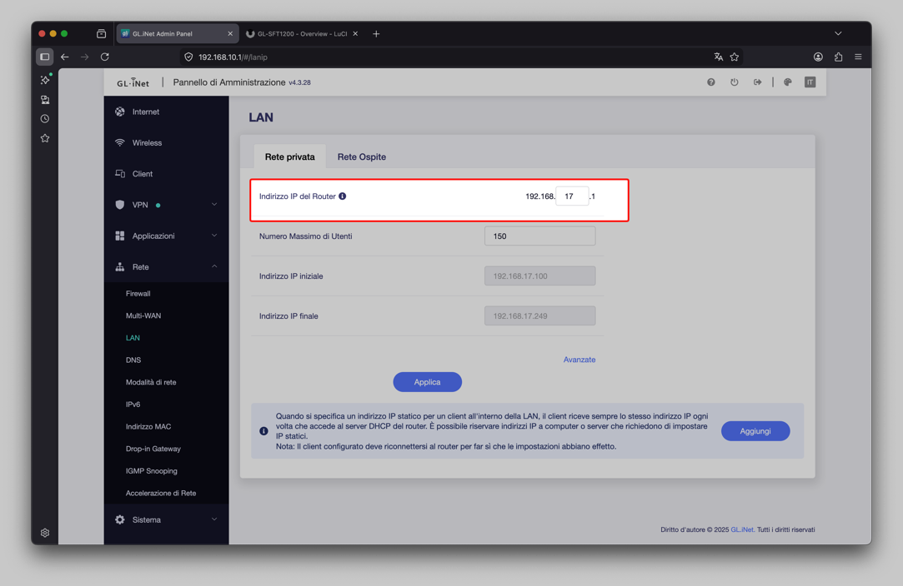

# Configurazione delle VLAN per i dispositivi fisici

|  Interfaccia vecchia | Interfaccia nuova  |
| ------------ | ------------ |
|   |  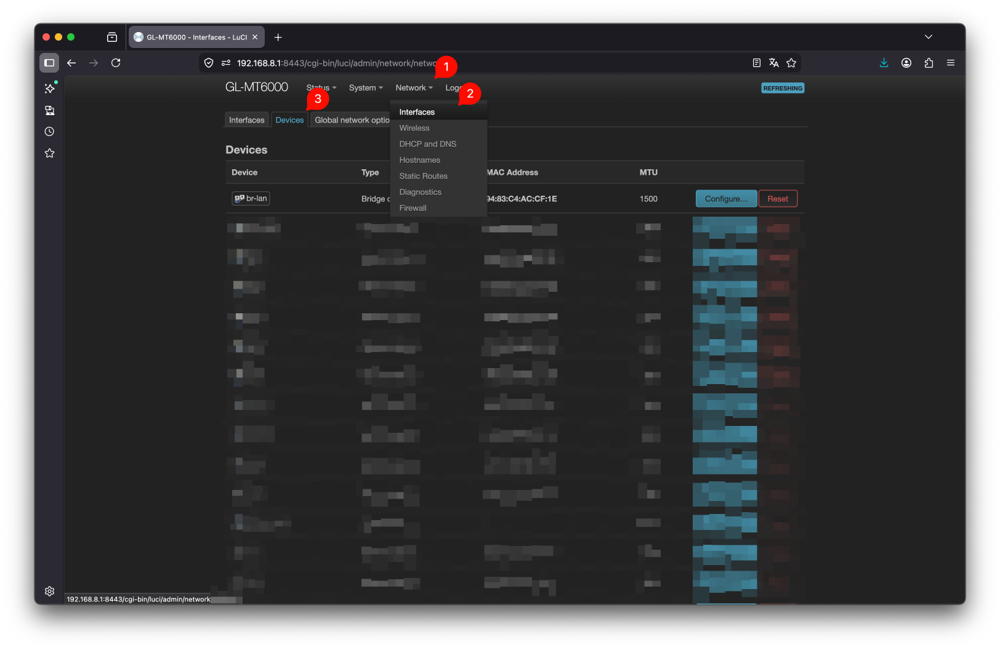 |
| | 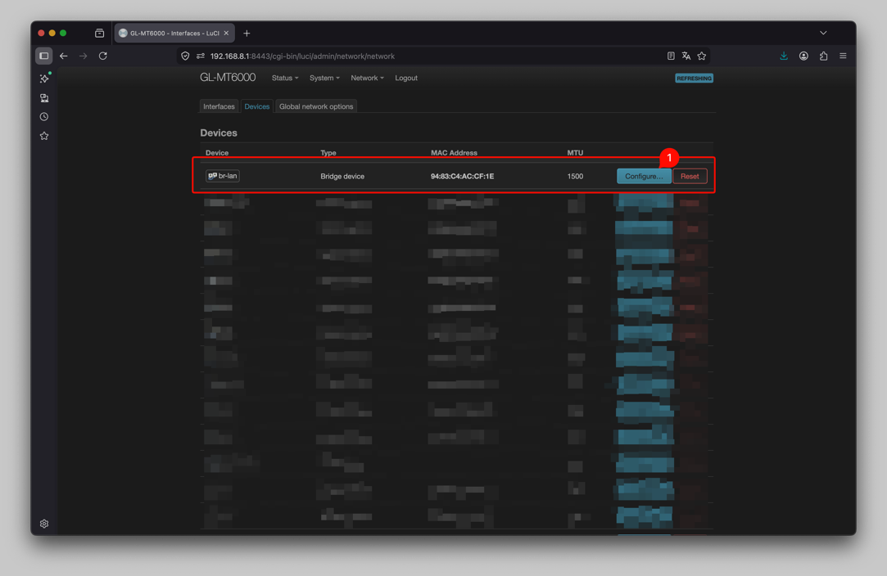 |
|   |  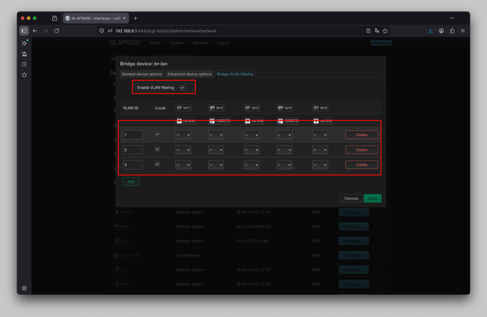 |
|   |   |

<!--

-->

SCR-20260422-rkde

## Native VLAN

> [!WARNING]  
> Per evitare di essere escluso dalla rete, effettuare la prima configurazione, impostando una porta LAN del router come Native VLAN (`primary VLAN ID`) sulla VLAN di management

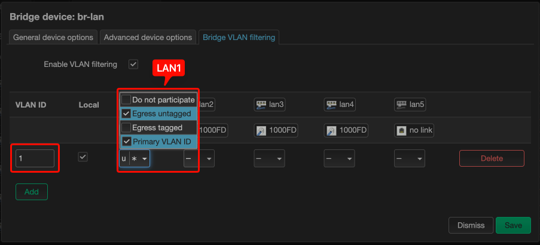

### Uso della native VLAN per la configurazione di eventuali server Proxmox

Proxmox supporta molto bene le VLAN. Configurare come segue:

1. usare una porta tagged (trunk) con native vlan per installare proxmox
   1. N.B.: proxmox non supporta il tagging durante la fase di installazione
2. Attivare la funzionalita' `vlan aware`
3. configurare proxmox per utilizzare la VLAN desiderata (`server`)
4. quando si creano i container/vm specificare la vlan desiderata durante la configurazione della rete


## Rimuovere la LAN principale da br-lan di default e associarla alla VLAN principale

> [!IMPORTANT]  
> Passaggio fondamentale per evitare problemi di connessione in questa fase

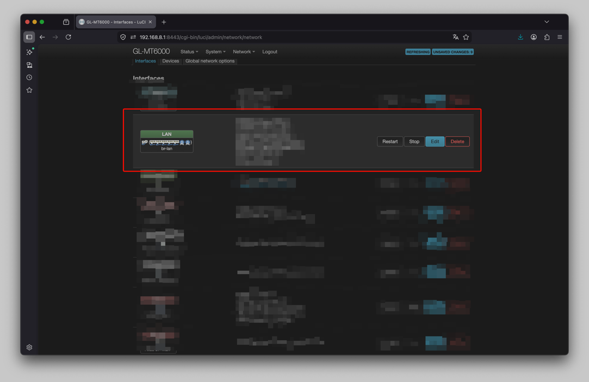

|  Interfaccia vecchia | Interfaccia nuova  |
| ------------ | ------------ |
|   | 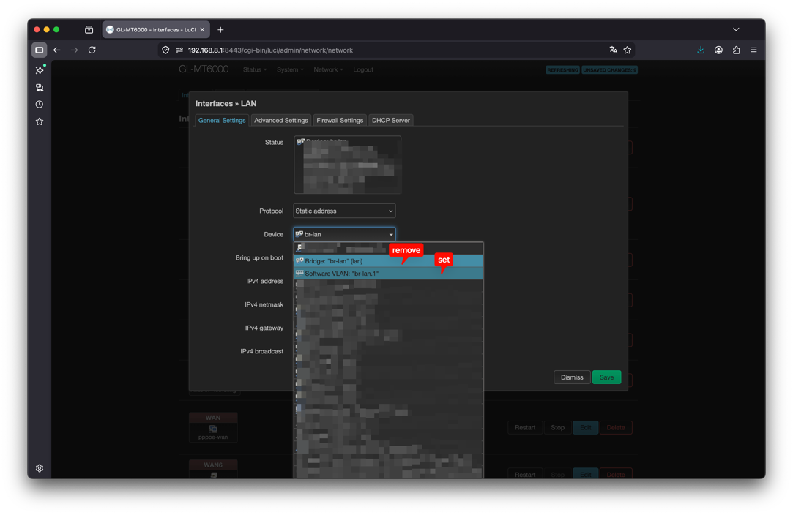  |

## Definire le interfacce per tutte le VLAN

|  Interfaccia vecchia | Interfaccia nuova  |
| ------------ | ------------ |
|   | 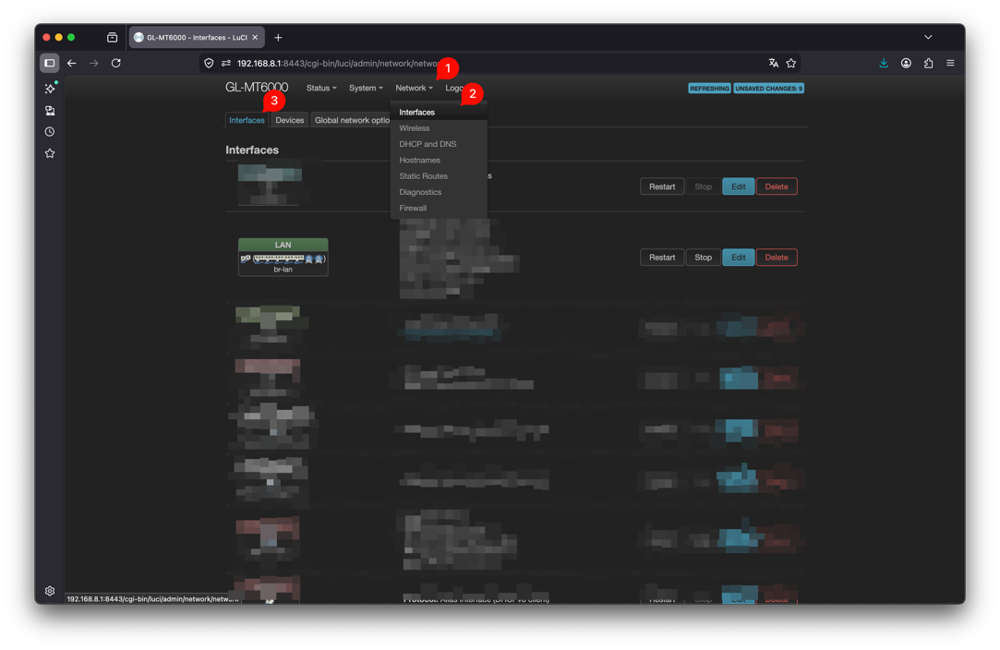  |
<!-- |   |   | -->


### Definizione di tutte le interfacce

**Ripetere il procedimento per ciascuna VLAN**

#### Versioni piu' vecchie

| Dettagli  | Screenshot  |
| ------------ | ------------ |
| Creazione dell'interfaccia home |   |
| Impostazione DHCP per l'interfaccia (eseguire prima questo perche' l'interfaccia grafica ha un bug sulle versioni vecchie) |   |
| Assegnazione IP statico per la VLAN |   |
| Creare nuova zona firewall per la VLAN |   |
|  Risultato |   |

#### Versioni nuove (es.21...)

| Dettagli  | Screenshot  |
| ------------ | ------------ |
|  definzione dell'interfaccia |  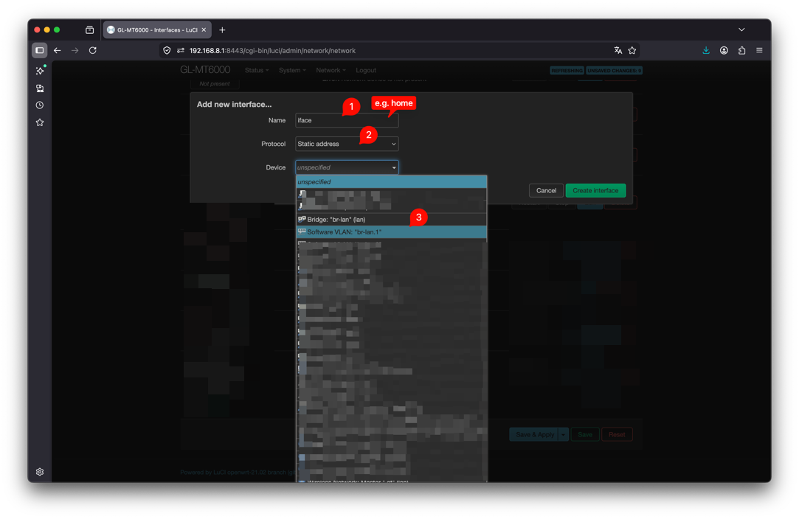 |
|   |  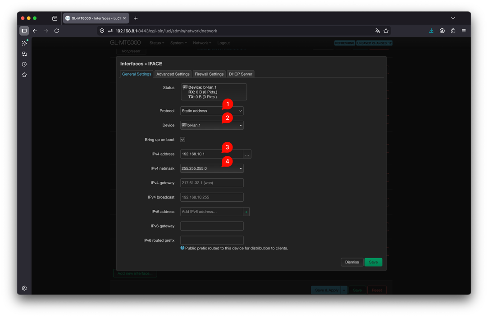 |
|   |  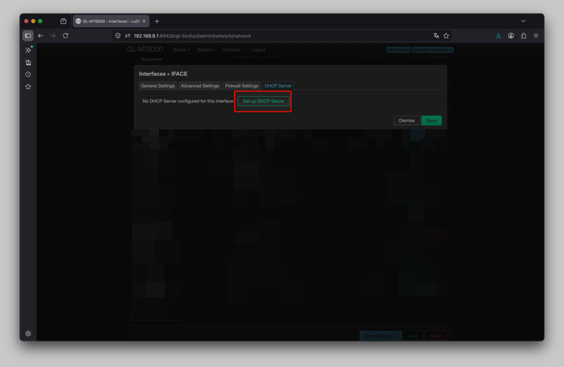 |
|   |  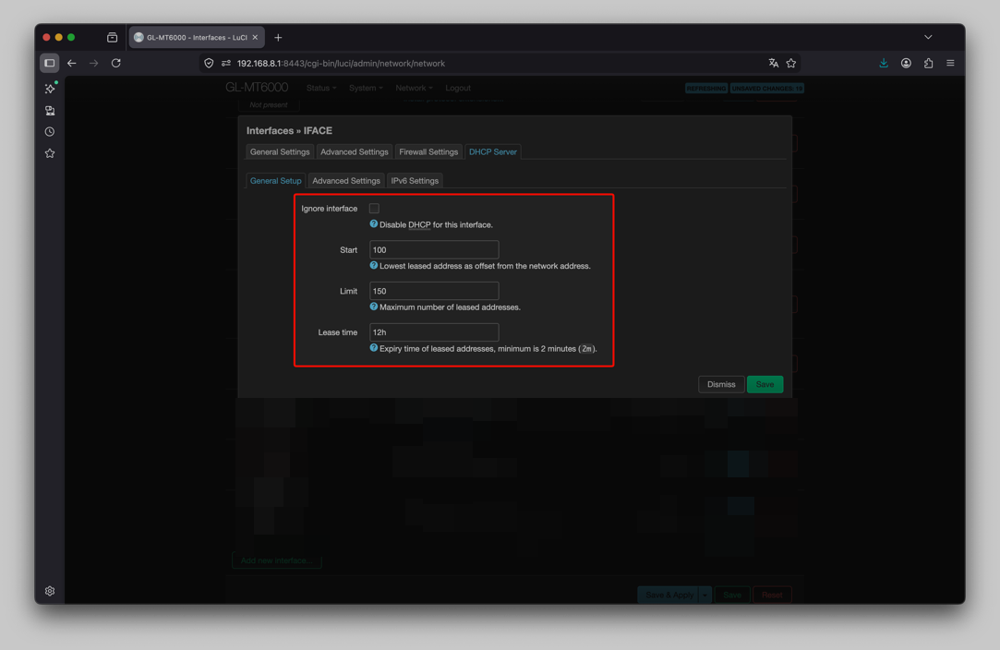 |
|   |  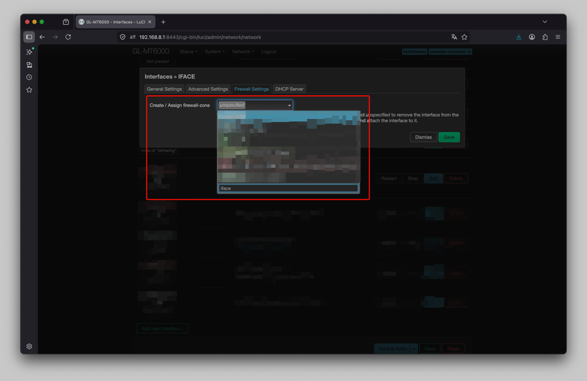 |
|   |   |

## Consentire la gestione del router dall'interfaccia home (via firewall)

> [!NOTE]  
> Ignorare le regole firewall preconfigurate e considerare solo quella in esame

| Dettagli  | Screenshot  |
| ------------ | ------------ |
|  Consentire regola input da zona home |   |
|   |   |

> [!TIP]
> A questo punto e' possibile applicare le modifiche

# Configurare le reti wireless

> [!TIP]
> Il router verra' gestito dalla VLAN home quindi non creo una wlan per la VLAN di gestione (management)

| Dettagli  | Screenshot  |
| ------------ | ------------ |
|  Associare la rete 5GHz di default alla VLAN home |   |
| Eliminare la rete 2.4GHz di default per evitare problemi di avvio dell'interfaccia  |   |
| Creazione delle reti wireless per le VLAN  |   |
| Impostare password e tipo di sicurezza della rete  |   |

> [!NOTE]  
> All'occorrenza, configurare anche le reti 5Ghz

# Regole firewall

> [!TIP]
> Considerare il rapporto ZONE > impostazioni zona (input, output, reject) > Traffic rules
>
> info aggiuntive di seguito

> [!IMPORTANT]  
> Nella sezione "*Vecchi OpenWRT (o anche nuovi???) traffico non funziona (da confermare)*" si evincono delle informazioni sulla configurazione delle zone reperite nella documentazione ufficiale e sui forum.
>
> I contenuti illustrati sono in attesa di conferma
>
> Visionare anche quella sezione per avere una panormica piu' chiara

> [!NOTE]  
> input, output, forward si riferiscono al router stesso
>
> input = dalla zona verso il router
> output = dal router verso la zona
> forward = da una zona all'altra attraversando il router

## Tutte le zone devono poter raggiungere la WAN (accesso a internet)

| Dettagli  | Screenshot  |
| ------------ | ------------ |
|  Nozione preliminare: la confiurazione di base funziona per zona (zona + regole standard) - in fase inziale ragionare per colonna |   |
|  Permettere il forwarding da tutte le zone alla zona WAN |   |

## Abilitare DNS per tutte le zone
| Dettagli  | Screenshot  |
| ------------ | ------------ |
| Scheda traffic rules  |   |
| Dove creare nuove regole  |   |
|  Abilitare regole DNS per tutte le zone (altrimenti DNS non funziona) |   |
| Regole DNS definite |   |

## Abilitare DHCP per le zone

> [!IMPORTANT]  
> Configurare per tutte le zone VLAN

| Dettagli  | Screenshot  |
| ------------ | ------------ |
|  Configurazione della regola |   |


## Regole di forwarding intra-zones

> [!TIP]
> Tenere sempre presente che il firewall di OpenWRT funziona per zona!
> 
> Quindi modificare per singola zona! Ad esempio, da iot scegliere verso chi si puo' effettuare forward
>
> Riptere la configurazione per tutte le zone fino ad ottenere il risultato desiderato

| Dettagli  | Screenshot  |
| ------------ | ------------ |
|  regole tra le zone |   |
| Esempio di come effettuare le modifiche  |   |

## Regole firewall custom

> [!NOTE]  
> Configurare in base alle proprie esigenze personali

> [!TIP]
> Se la confiurazione avviene per indirizzo IP e non per MAC Address allora assicurarsi che gli indirizzi IP coinvolti siano configurati in modo statico (associazione statica tra IP e MAC)

> [!IMPORTANT]  
> Per i dispositivi che devono comunicare intra-zones via mDNS bisogna configurare un servizio apposito (preferibilmente tramite Avhai)

| Dettagli  | Screenshot  |
| ------------ | ------------ |
|  Dispositivo IoT che ha bisogno di comunicare con un server |   |
| Dispositivi multimediali che si trovano in IoT ma devono comunicare con home (mDNS) ... questo da solo non basta!  |   |


# Configurazione di Avhai per mDNS intra-zones

> [!TIP]
> Su alcuni router e' necessario usare questo comando SSH:

```bash
ssh -o HostKeyAlgorithms=+ssh-rsa -o PubkeyAcceptedKeyTypes=+ssh-rsa root@192.168.10.1

scp -O -o HostKeyAlgorithms=+ssh-rsa -o PubkeyAcceptedKeyTypes=+ssh-rsa root@192.168.10.1:/root/file ./
```

| Dettagli  | Screenshot  |
| ------------ | ------------ |
| Abilitare accesso SSH da VLAN home  |   |
|  Testare connessione SSH |   |
|  Cercare pacchetti Avahi |   |
|  Installazione di Avahi (**usare versione DBUS**) |   |
|  Pacchetti installati |  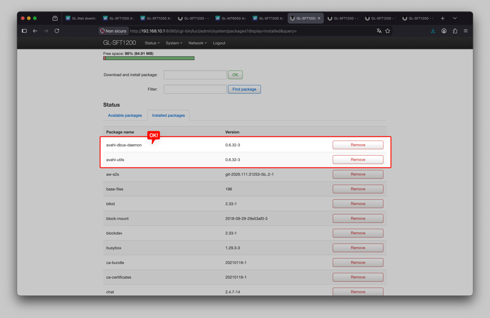 |

## Configurazione di Avahi

> [!WARNING]  
> Come indicato nella sezione firewall, per il corretto funzionamento di mDNS occorre anche configurare le regole firewall come indicato di seguito!

### Configurazione

File di configurazione:

`/etc/avahi/avahi-daemon.conf`

Modificare in base alle proprie zone

```ini
[server]
#host-name=foo
#domain-name=local
use-ipv4=yes
use-ipv6=yes
check-response-ttl=no
use-iff-running=no
allow-interfaces=br-home,br-iot

[publish]
publish-addresses=yes
publish-hinfo=yes
publish-workstation=no
publish-domain=yes
#publish-dns-servers=192.168.1.1
#publish-resolv-conf-dns-servers=yes

[reflector]
enable-reflector=yes
reflect-ipv=no

[rlimits]
#rlimit-as=
rlimit-core=0
rlimit-data=4194304
rlimit-fsize=0
rlimit-nofile=30
rlimit-stack=4194304
rlimit-nproc=3
```

**Prestare massima attenzione a**

```ini
allow-interfaces=br-home,br-iot
enable-reflector=yes
```

### Regole firewall per il funzionamento

|  Descrizione | Screenshot  |
| ------------ | ------------ |
| Creare regola per permettere il traffico mDNS dalla zona iot al router  |  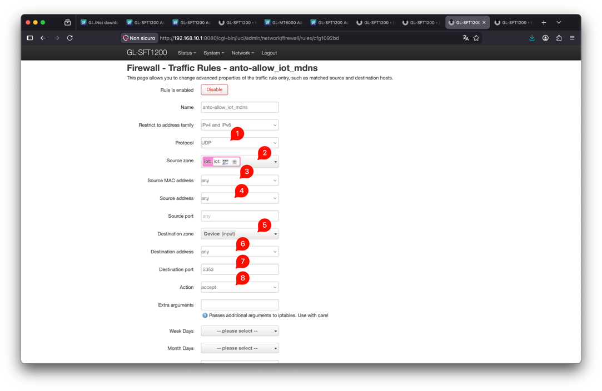 |
| Risultato  |  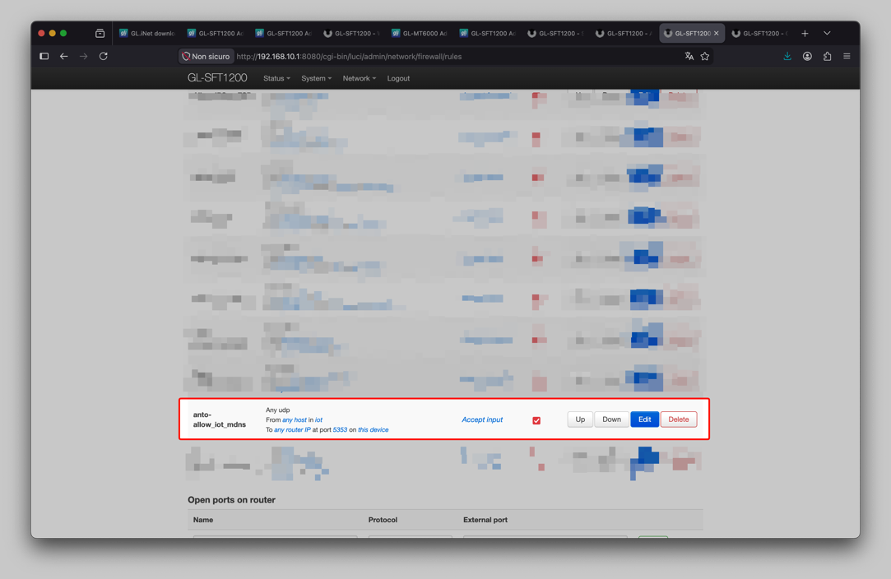 |
<!-- |   |   |
|   |   | -->

> [!TIP]
> Sarebbe opportuno abilitare mDNS per tutte le zone!

### Attivazione

Riavviare il servizio:

```bash
/etc/init.d/avahi-daemon enable
/etc/init.d/avahi-daemon restart
#
# check
ps | grep avahi
logread | grep -i avahi
```

# Riepilogo configurazione basilare

> [!NOTE]  
> Questa sezione rappresenta una configurazione funzionante basilare che costituisce un breve riepilogo di quanto visto finora

> [!IMPORTANT]  
> Questo e' solo un esempio, non implementa tutte le regole di sicurezza necessarie

> [!TIP]  
> Si consiglia di configurare le regole firewall come segue:
> 
> per prima cosa abilitare regole generiche di forwarding tra zone:
> per sicurezza disattivare input e forward (che verra' configurato, se ove necessario, tramite traffic rules)
> 
> 1. abilitare DNS per tutte le zone
> 2. abilitare DHCP per tutte le zone
> 3. abilitare regole specifiche per il traffico desiderato
> 4. abilitare mDNS dove necessario
> 5. disabilitare tutto il traffico da una certa zona verso le altre


|  Descrizione | Screenshot  |
| ------------ | ------------ |
| Configurazione dello switch fisico  |  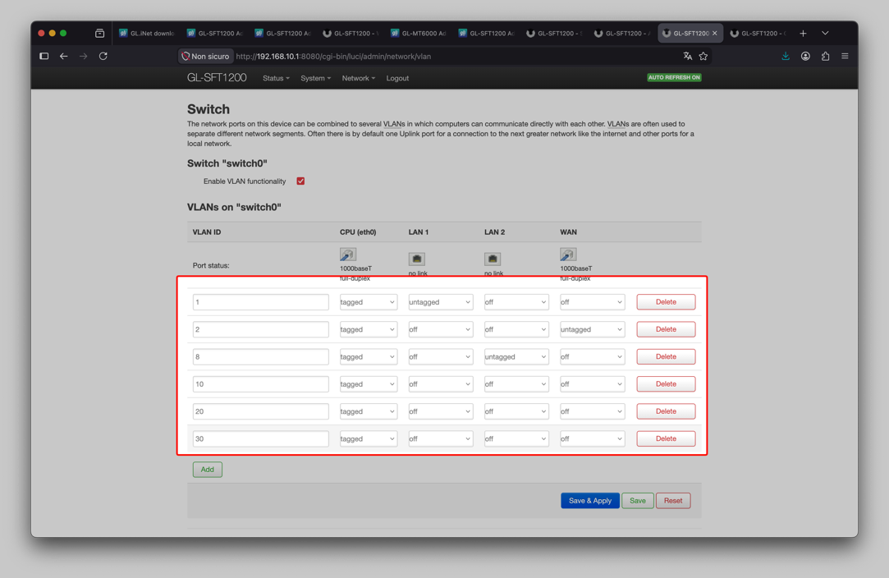 |
| Configurazione delle interfacce  |  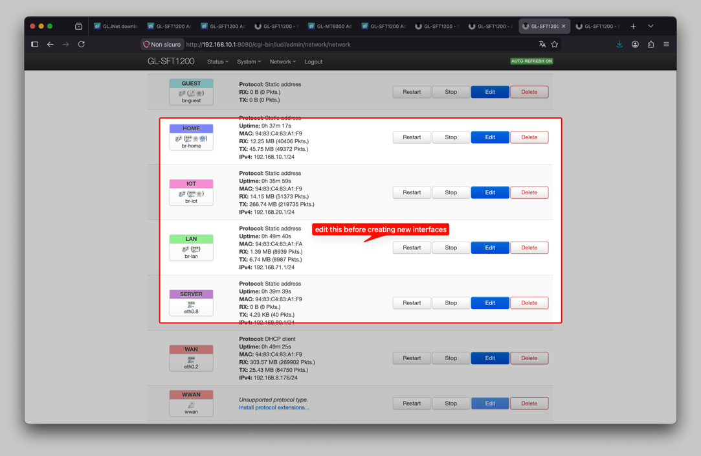 |
| Reti wireless  |  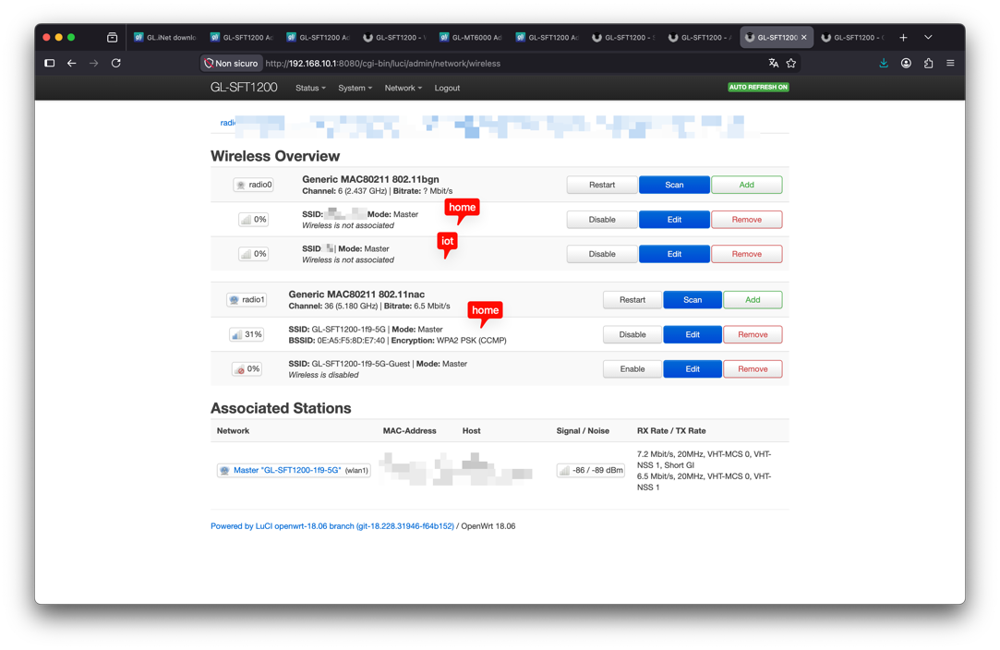 |
| Zone firewall  |  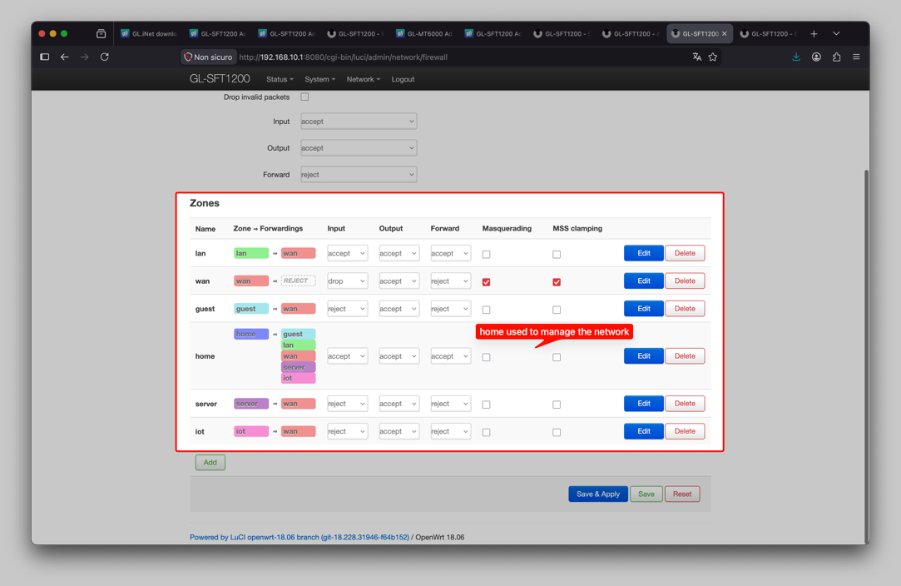 |
| Traffic rules fiewall (il ban iot->home è tecnicamente **SUPERFLUO** in quanto la zona iot già prevede il blocco del forwarding dalla configurazione delle zone firewall)  |  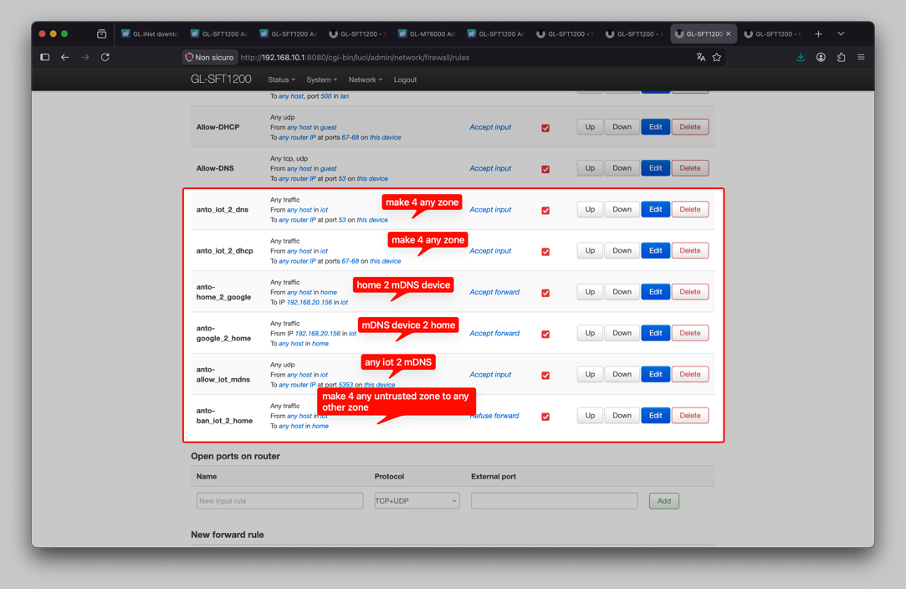 |
| Avahi per mDNS  |  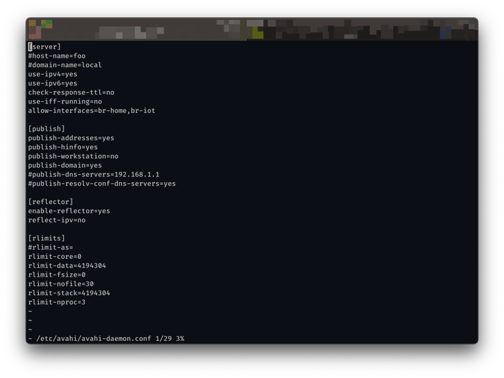 |
<!-- |   |   |
|   |   |
|   |   |
|   |   |
|   |   |
|   |   |
|   |   |
|   |   |
|   |   |
|   |   |
|   |   |
|   |   | -->

## Eventuali regole per IoT->home

- Il traffico da home e' abilitato di default verso ogni zona (forwarding di zona abilitato + traffico intra-vlan configurato dalle regole della zona)

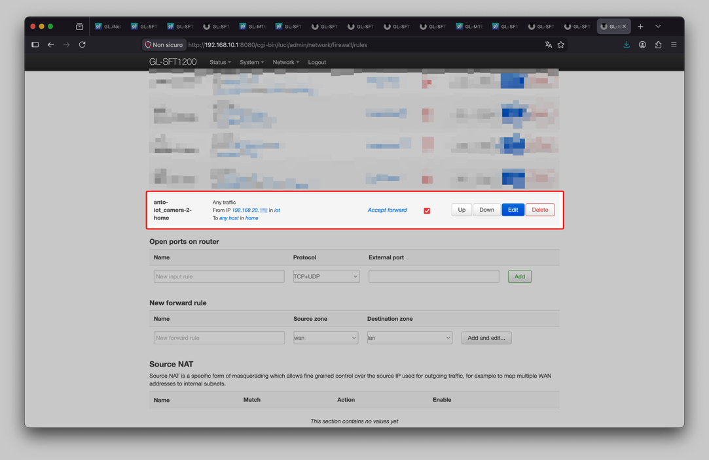

# Trubleshooting

## Firewall

> [!CAUTION]
> Le regole vengono interpretate in ordine, dalla prima all'ultima. Quindi un *allow* specifico deve essere posto prima di un *deny* generico

| Dettagli  | Screenshot  |
| ------------ | ------------ |
|  Le 2 VLAN non comunicano --> aggiunta di regole manuali |   |
|   |   |
|   |   |
<!-- |   |   |
|   |   | -->

## Traffico intra-vlan non funziona

Se il traffico tra zone non funziona, allora (esempio):

1. forwarding da server a iot  (ABILITARE FORWARD DA ZONA A ZONA nelle regole della zona)
2. rule ACCEPT from 192.168.8.30 to 192.168.30.21  (permette la connessione tra i due device dalle traffic rules)
3. rule ACCEPT from 192.168.30.21 to 192.168.8.30  (permette il ritorno dei pacchtti tramite le traffic rules)
4. rule REJECT from server to iot  (blocca tutto il resto dalle traffic rules)
5. rule REJECT from iot to server  (blocca tutto il resto dalle traffic rules)

Fonti usate per giungere a questa conclusione:

- [https://oldwiki.archive.openwrt.org/doc/uci/firewall](https://oldwiki.archive.openwrt.org/doc/uci/firewall "https://oldwiki.archive.openwrt.org/doc/uci/firewall")
- [https://openwrt.org/docs/guide-user/firewall/fw3_configurations/fw3_config_examples](http://https://openwrt.org/docs/guide-user/firewall/fw3_configurations/fw3_config_examples "https://openwrt.org/docs/guide-user/firewall/fw3_configurations/fw3_config_examples")
- [https://forum.openwrt.org/t/firewall-zones-forwards-and-rules/25197](http://https://forum.openwrt.org/t/firewall-zones-forwards-and-rules/25197 "https://forum.openwrt.org/t/firewall-zones-forwards-and-rules/25197")
[https://forum.openwrt.org/t/firewall-traffic-rules-override-zone-settings/150238](http://https://forum.openwrt.org/t/firewall-traffic-rules-override-zone-settings/150238 "https://forum.openwrt.org/t/firewall-traffic-rules-override-zone-settings/150238")
[https://forum.openwrt.org/t/how-to-set-up-firewall-rules-zones-correctly-for-vlans/105686](http://https://forum.openwrt.org/t/how-to-set-up-firewall-rules-zones-correctly-for-vlans/105686 "https://forum.openwrt.org/t/how-to-set-up-firewall-rules-zones-correctly-for-vlans/105686")
[https://forum.archive.openwrt.org/viewtopic.php?id=72338](https://forum.archive.openwrt.org/viewtopic.php?id=72338http:// "https://forum.archive.openwrt.org/viewtopic.php?id=72338")

## (luci rotto) Aggiungere regola per server->iot

```bash
uci add firewall forwarding
uci set firewall.@forwarding[-1].src='server'
uci set firewall.@forwarding[-1].dest='iot'
uci commit firewall
/etc/init.d/firewall restart
```

## Luci corrotto

```
/usr/lib/lua/luci/dispatcher.lua:230: /etc/config/luci seems to be corrupt, unable to find section 'main'
stack traceback:
	[C]: in function 'assert'
	/usr/lib/lua/luci/dispatcher.lua:230: in function 'dispatch'
	/usr/lib/lua/luci/dispatcher.lua:127: in function </usr/lib/lua/luci/dispatcher.lua:126>
```

soluzione (da ssh sul router):

```bash
ls /etc/init.d/ | grep -E "nginx|httpd|luci"
rm -f /etc/config/luci
# /etc/init.d/uhttpd restart
/etc/init.d/nginx restart
```
```bash
cp /etc/config/luci /etc/config/luci.bak 2>/dev/null

cat > /etc/config/luci <<'EOF'
config core main
	option lang auto
	option mediaurlbase /luci-static/bootstrap
	option resourcebase /luci-static/resources
	option ubuspath /ubus/

config extern flash_keep
	option uci "/etc/config/"
	option dropbear "/etc/dropbear/"
	option openvpn "/etc/openvpn/"
	option passwd "/etc/passwd"
	option opkg "/etc/opkg.conf"
	option firewall "/etc/firewall.user"
	option uploads "/lib/uci/upload/"

config internal languages

config internal sauth
	option sessionpath "/tmp/luci-sessions"
	option sessiontime 3600

config internal ccache
	option enable 1

config internal themes

config internal apply
	option rollback 90
	option holdoff 4
	option timeout 5
	option display 1.5
EOF
```

```bash
/etc/init.d/uhttpd restart
rm -f /tmp/luci-indexcache /tmp/luci-modulecache/*

rm -f /tmp/luci-indexcache
rm -rf /tmp/luci-modulecache/*
```

```bash
uci show luci
uci show luci.main
ubus call uci get '{"config":"luci","section":"main"}'
```

```bash
/etc/init.d/ubus restart
/etc/init.d/rpcd restart
/etc/init.d/uhttpd restart
```

# Comandi utili

### DHCP

```bash
# Vedi tutti i lease DHCP attivi
cat /tmp/dhcp.leases

# Oppure con più dettagli (MAC, IP, hostname)
cat /tmp/dhcp.leases | awk '{print $3, $4, $2}'

# Vedi anche i dispositivi che rispondono sulla rete
arp -a
```

### Check regole firewall

```bash
# Vedi tutte le regole firewall con nome
uci show firewall | grep -E "name|src_ip|dest_ip|target"
```

Visualizzare solo le regole di forwarding:

```bash
uci show firewall | grep -n "forwarding"
```

### Aggiunta regole via ssh

```bash
# Da server (Pi5) verso iot (cam)
uci add firewall rule
uci set firewall.@rule[-1].name='server-to-iot'
uci set firewall.@rule[-1].src='server'
uci set firewall.@rule[-1].dest='iot'
uci set firewall.@rule[-1].src_ip='192.168.8.30'
uci set firewall.@rule[-1].dest_ip='192.168.30.21'
uci set firewall.@rule[-1].target='ACCEPT'
uci set firewall.@rule[-1].proto='any'

# Da iot (cam) verso server (Pi5)
uci add firewall rule
uci set firewall.@rule[-1].name='iot-to-server'
uci set firewall.@rule[-1].src='iot'
uci set firewall.@rule[-1].dest='server'
uci set firewall.@rule[-1].src_ip='192.168.30.21'
uci set firewall.@rule[-1].dest_ip='192.168.8.30'
uci set firewall.@rule[-1].target='ACCEPT'
uci set firewall.@rule[-1].proto='any'

# Salva e applica
uci commit firewall
/etc/init.d/firewall restart
```

### Fix regole via ssh

```bash
uci set firewall.@rule[21].dest_ip='192.168.30.21'
uci commit firewall
/etc/init.d/firewall restart
```

# Test della rete

## Test dei path

| Dettagli  | Screenshot  |
| ------------ | ------------ |
|  da home a server |   |
|  da server a iot |   |

<!-- |   |   |
|   |   |
|   |   |
|   |   | -->

<!-- |  Test |   | -->

<!--
|   |   |
|   |   |
-->

<!--
|  Interfaccia vecchia | Interfaccia nuova  |
| ------------ | ------------ |
|   |   |


| Dettagli  | Screenshot  |
| ------------ | ------------ |
|   |   |
|   |   |


-->

# Spiegazioni per i nOObs

> [!WARNING]  
> Qusta sezione e' stata realizzata grazie all'aiuto dell'AI e NON verificata dall'autore

## Cos'e' una rete locale (LAN)?

Quando colleghi piu' dispositivi (PC, telefono, smart TV, telecamere) allo stesso router, questi si trovano tutti nella stessa **rete locale (LAN)**. Per default, tutti si "vedono" tra loro: il tuo PC puo' parlare con la telecamera IoT, la smart TV puo' tentare connessioni verso il tuo NAS, etc.

Questo va bene per una rete semplice, ma e' un problema di sicurezza: se un dispositivo IoT (tipicamente poco sicuro) viene compromesso, l'attaccante ha accesso a tutta la rete.

## Cos'e' uno switch?

Uno **switch** e' il "centralino" fisico della tua rete: e' il componente (spesso integrato nel router) che riceve i dati da una porta e li smista verso la porta di destinazione corretta. Ogni dispositivo collegato via cavo ethernet e' connesso a una porta dello switch.

Senza VLAN, uno switch manda il traffico di broadcast (annunci di rete, richieste DHCP, mDNS, etc.) a **tutte** le porte: tutti i dispositivi ricevono tutto.

## Cos'e' una VLAN?

Una **VLAN (Virtual LAN)** e' una rete locale virtuale: permette di dividere logicamente uno switch fisico in piu' switch "virtuali" isolati, senza bisogno di hardware separato.

```
Senza VLAN:
[PC] [Telefono] [Telecamera IoT] [NAS]  <-- tutti nella stessa rete, si vedono tutti

Con VLAN:
VLAN home:    [PC] [Telefono]
VLAN iot:     [Telecamera IoT]
VLAN server:  [NAS]
              ^--- isolate tra loro, il firewall decide chi puo' parlare con chi
```

Ogni VLAN ha un numero identificativo (VLAN ID) che viene "taggato" sui pacchetti ethernet, cosi' lo switch sa a quale rete virtuale appartiene ciascun pacchetto.

## Cos'e' OpenWRT e LuCI?

**OpenWRT** e' un sistema operativo Linux alternativo per router, molto piu' flessibile del firmware di fabbrica. I router GL.iNet lo supportano nativamente.

**LuCI** e' l'interfaccia web grafica di OpenWRT: ti permette di configurare tutto dal browser invece di usare la riga di comando.

In OpenWRT esiste gia' anche un concetto fondamentale: il **bridge**. Un bridge e' uno "switch software" interno al router che unisce porte fisiche, VLAN e interfacce logiche in un unico punto di gestione. Per questo nella guida compaiono nomi come `br-lan`, `br-home` o `br-iot`.

Questi bridge sono spesso **gia' preconfigurati** perche' OpenWRT, soprattutto sui dispositivi moderni con DSA, crea di default un bridge LAN di base (`br-lan`) per far funzionare subito le porte LAN come un'unica rete locale. Non e' un dettaglio opzionale: e' parte del modo in cui OpenWRT organizza internamente la rete.

Per questo motivo i bridge **non vanno creati a mano alla cieca**: nella maggior parte dei casi bisogna partire da quelli gia' presenti e modificarli o associarli correttamente alle VLAN. Creare bridge manuali inutili o duplicati puo' portare a configurazioni incoerenti, perdita di connettivita', porte finite nel bridge sbagliato o conflitti con `br-lan` gia' esistente.

## Perche' i passaggi della guida vanno fatti in quest'ordine?

### 1. Prima si configura lo switch fisico (VLAN sui dispositivi fisici)

Lo switch integrato nel router deve sapere quali porte appartengono a quale VLAN. Questo e' il livello piu' basso: hardware. Senza questo passaggio, i pacchetti non vengono instradati correttamente a livello fisico.

> Se salti questo passaggio: i dispositivi collegati via cavo non vengono assegnati alla VLAN giusta.

### 2. Poi si creano le interfacce logiche

OpenWRT deve avere un'**interfaccia software** per ciascuna VLAN: e' come dire al sistema operativo "questa VLAN esiste, le assegno l'indirizzo IP X.X.X.1, gestisco il suo DHCP da qui". Ogni interfaccia corrisponde a un bridge (es. `br-home`, `br-iot`) che fa da "punto di accesso" del router verso quella VLAN.

In pratica non si sta "inventando da zero" la rete del router: si stanno collegando correttamente le VLAN ai bridge che OpenWRT usa gia' come struttura interna. Ecco perche' in questa guida si rimuove prima la LAN dal bridge di default e poi si riassegna tutto in modo ordinato, invece di creare bridge manuali senza criterio.

> Se salti questo passaggio: il router non sa come gestire il traffico di quella VLAN, i dispositivi non ricevono un IP.

### 3. Poi si configurano le reti wireless

Le reti Wi-Fi (SSID) devono essere **associate** a una specifica VLAN/interfaccia. Altrimenti, tutti i dispositivi wireless finiscono nella stessa rete indipendentemente a quale Wi-Fi si connettono.

> Se salti questo passaggio: creare SSID separati non serve a niente, tutto il traffico wireless va comunque sulla stessa rete.

### 4. Poi si configura il firewall

Per default OpenWRT, una volta create le VLAN, le **isola completamente**: nessuna zona puo' comunicare con le altre. Il firewall deve essere configurato esplicitamente per:

- **Permettere l'accesso a internet (WAN)** da tutte le zone — senza questa regola i dispositivi IoT non hanno internet
- **Abilitare DNS** — il DNS e' il servizio che traduce `google.com` in un indirizzo IP. Se non e' abilitato esplicitamente per ogni zona, i siti non si aprono anche se la connessione c'e'
- **Abilitare DHCP** — il DHCP e' il servizio che assegna automaticamente un indirizzo IP ai dispositivi quando si connettono. Senza, i dispositivi rimangono senza IP
- **Definire i forwarding intra-zone** — se vuoi che il tuo PC (in `home`) possa vedere il NAS (in `server`), devi dirlo esplicitamente al firewall

> Se salti questo passaggio: internet non funziona sulle nuove VLAN, oppure alcune VLAN non possono comunicare con quelle che dovrebbero.

> [!CAUTION]
> Le regole firewall vengono lette dall'alto verso il basso. Una regola `ALLOW` specifica deve stare **prima** di un `DENY` generico, altrimenti viene ignorata e il blocco generico ha la precedenza.

### 5. Infine si configura Avahi per mDNS

**mDNS (multicast DNS)** e' il protocollo usato da dispositivi Apple (AirPlay, AirPrint), Chromecast, stampanti di rete etc. per "annunciarsi" sulla rete locale senza bisogno di un server DNS centrale.

Il problema: mDNS usa pacchetti **multicast** che per definizione non attraversano i confini di rete. Se la tua Apple TV e' nella VLAN `iot` e il tuo Mac e' nella VLAN `home`, non si vedono.

**Avahi** e' un servizio che fa da "traduttore": ascolta gli annunci mDNS su una VLAN e li "riflette" sulle altre. Deve essere configurato dopo il firewall perche' ha bisogno che le interfacce esistano gia' e che le regole firewall per il multicast siano attive.

> Se salti questo passaggio: Chromecast, AirPlay, stampanti di rete non funzionano tra VLAN diverse.

## Riepilogo visivo

```
[Dispositivo fisico / Wi-Fi]
        |
        v
[Switch fisico con VLAN tag]   <-- Passo 1: configurazione VLAN fisiche
        |
        v
[Interfaccia logica OpenWRT]   <-- Passo 2: interfacce + DHCP + IP
        |
        v
[Rete wireless associata]      <-- Passo 3: SSID -> VLAN
        |
        v
[Firewall / Zone]              <-- Passo 4: chi puo' parlare con chi
        |
        v
[Avahi per mDNS]               <-- Passo 5: servizi locali cross-VLAN
```

## Glossario rapido

| Termine | Spiegazione semplice |
|---------|----------------------|
| **LAN** | La tua rete di casa |
| **WAN** | Internet (la rete "esterna") |
| **VLAN** | Sottorete virtuale isolata logicamente |
| **Switch** | Il "centralino" fisico che smista i cavi ethernet |
| **Bridge** | Componente software che unisce piu' interfacce di rete |
| **DHCP** | Il servizio che da' automaticamente un IP ai dispositivi |
| **DNS** | Il servizio che traduce nomi (google.com) in indirizzi IP |
| **Firewall** | Il "guardiano" che decide quali connessioni sono permesse |
| **Zona (firewall)** | Un gruppo di interfacce con le stesse regole di sicurezza |
| **Forward** | Permettere al traffico di passare da una zona a un'altra |
| **mDNS** | Protocollo per scoprire dispositivi locali (Chromecast, AirPlay) |
| **Avahi** | Servizio che propaga mDNS tra VLAN diverse |
| **LuCI** | L'interfaccia web grafica di OpenWRT |
| **OpenWRT** | Sistema operativo Linux per router |


<!--

> [!NOTE]  
> Highlights information that users should take into account, even when skimming.

> [!TIP]
> Optional information to help a user be more successful.

> [!IMPORTANT]  
> Crucial information necessary for users to succeed.

> [!WARNING]  
> Critical content demanding immediate user attention due to potential risks.

> [!CAUTION]
> Negative potential consequences of an action.
> 
-->
